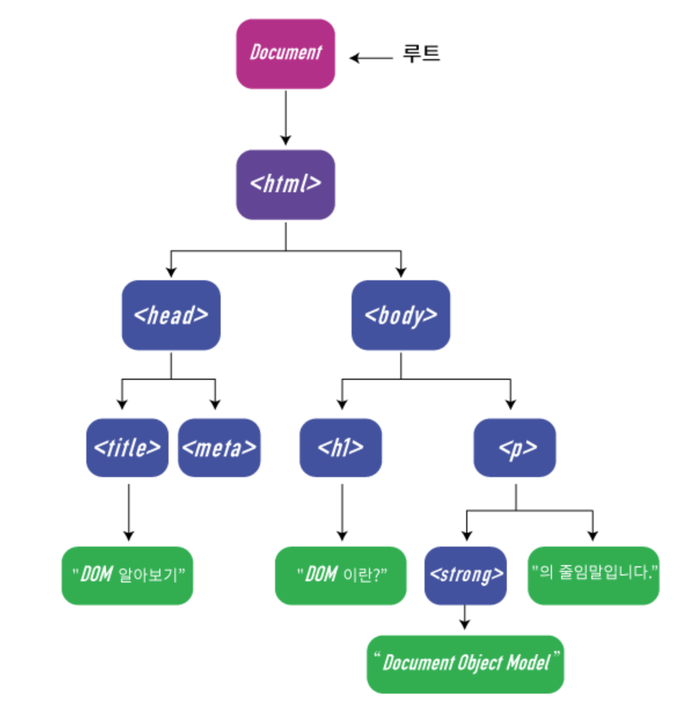
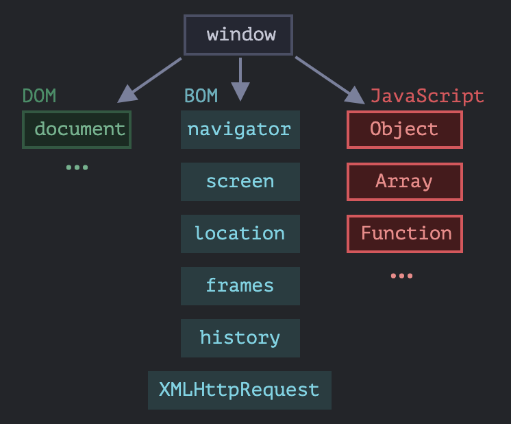

# 브라우저의 동작

### 1. 주소 해석(URI 해석):

> 브라우저는 입력된 주소를 해석하여 해당하는 프로토콜(일반적으로 HTTP 또는 HTTPS), 호스트명, 포트, 경로 등의 정보를 추출.

### 2. DNS 조회:

> 브라우저는 호스트명을 IP 주소로 변환하기 위해 DNS(Domain Name System) 서버에 요청을 보냄. 이를 통해 웹 서버의 IP 주소를 얻음.

### 3. 서버 연결:

> 얻은 IP 주소와 포트 번호를 사용하여 웹 서버와 TCP/IP 연결을 설정. 이를 통해 클라이언트(브라우저)와 서버 간에 데이터를 주고받을 수 있는 통로 오픈.

### 4. HTTP 요청 송신:

> 브라우저는 서버에게 HTTP 요청 메시지를 전송. 이 요청 메시지에는 주소로부터 파싱한 경로 및 추가적인 정보(메서드, 헤더 등)가 포함.

### 5. HTTP 응답(서버 응답) 수신:

> 서버는 요청을 받고 처리한 후, HTTP 응답 메시지를 생성하여 클라이언트에게 송신. 이 응답 메시지에는 상태 코드, 헤더 정보, 본문 등이 포함.

### 6. 응답 처리:

> 브라우저는 서버로부터 받은 응답 메시지를 처리. 이 과정에서는 응답의 상태 코드를 확인하여 요청이 성공적으로 처리되었는지 확인하고, 헤더 정보를 분석하여 다음 동작을 결정.

### 7. HTML Parsing 및 렌더링:

> 성공적인 응답을 받은 경우, 브라우저는 HTML을 파싱하여 [DOM](#기타) 트리를 생성하고, CSS를 파싱하여 CSS 객체 모델을 생성. 이후 둘을 결합하여 렌더 트리를 구축하고, 레이아웃을 계산하고, 화면에 표시될 요소들을 그리는 등의 작업을 수행하여 최종적으로 화면에 웹 페이지를 표시.

### 8. 자원 로딩:

> HTML 파싱 과정에서 외부 자원(이미지, 스크립트, 스타일 시트 등)에 대한 요청이 있을 경우, 브라우저는 이러한 자원들을 추가로 서버에 요청하고 받아옴. 이후에는 해당 자원들을 렌더링된 페이지에 삽입하여 화면에 표시.

### 9. 사용자 상호작용 및 이벤트 처리:

> 웹 페이지가 표시된 이후에는 사용자와의 상호작용을 위한 이벤트 처리가 이루어짐. 이벤트 처리는 사용자의 클릭, 입력, 스크롤 등의 동작에 따라 발생하며, 이에 대한 적절한 반응을 위해 JavaScript 등의 스크립트가 실행.

- 참조
  - [브라우저 동작(MDN)](https://developer.mozilla.org/ko/docs/Web/Performance/How_browsers_work) : 좀더 자세히 동작과정을 이해하고, 최적화 방법을 모색할 수 있다.

---

---

## 기타

- DOM(Document Object Model) : 문서 객체 모델.

        - HTML, XML같은 마크업 문서의 프로그래밍 인터페이스
        - 트리구조의 객체로 이루어져있음 (<태그>가 속성으로)
        - root는 document(window는 브라우저 객체이다). 그 아래 html 속성. 코드로 예를 들자면.

  ```javascript
  const document = {
    html: {
      head,
      body,
    },
  };
  ```

    

  <span style="color:red">!) window와 종종 착각하고는 하는데, document는 dom 최상위 객체, window는 브라우저(호스트 환경) 최상위 객체.</span>
  

  - DOM 참조 : [MDN](https://developer.mozilla.org/ko/docs/Web/API/Document_Object_Model/Introduction), [W3C](https://dom.spec.whatwg.org/)
  - 브라우저 참조 : [window와 BOM](https://ko.javascript.info/browser-environment)
